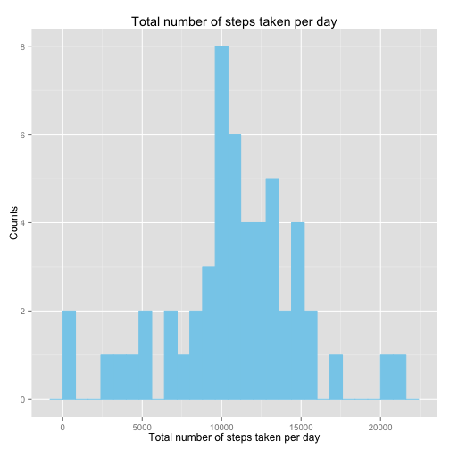
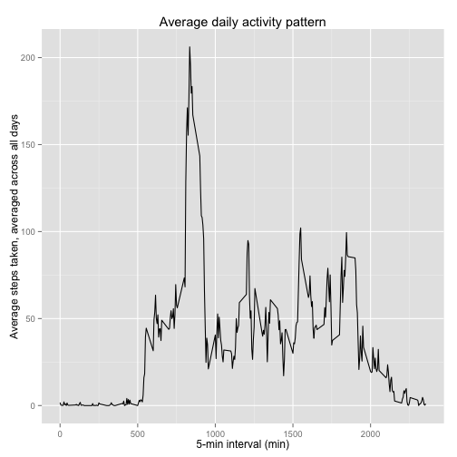
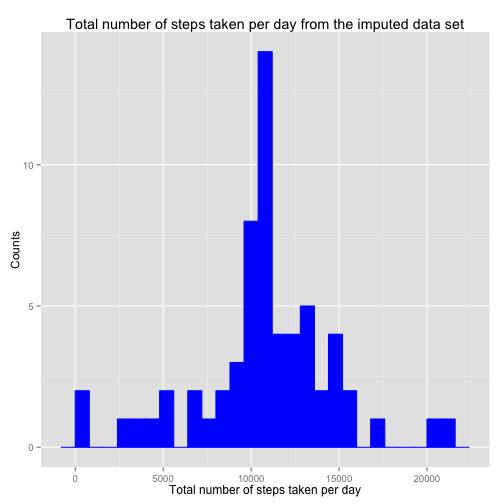
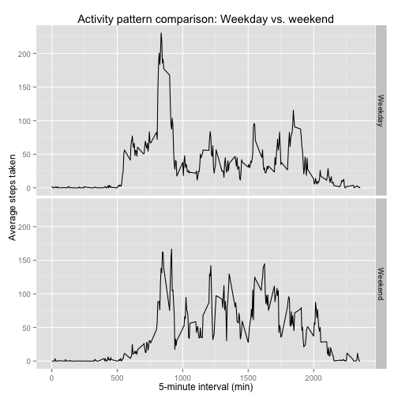

## Loading and preprocessing the data

```r
## Load the data set
library("downloader")
download("https://d396qusza40orc.cloudfront.net/repdata%2Fdata%2Factivity.zip", "activity.zip", mode = "wb")
unzip("activity.zip")
df <- read.csv("activity.csv")
```


## What is mean total number of steps taken per day?

```r
## Calculate the total number of steps taken per day
daily_total <- aggregate(steps ~ date, df, sum, na.rm = TRUE)

## Make a histogram of the total number of steps taken per day
library("ggplot2")
p2 <- ggplot(daily_total, aes(x = steps)) + geom_histogram(binwidth = 800, col = "skyblue", fill = "skyblue")
p2 + labs(title = "Total number of steps taken per day") + labs (x = "Total number of steps taken per day", y = "Counts")
```

 


**Mean of the total number of steps taken per day is 10766.**

```r
## Calculate the mean of the total number of steps taken per day
round(mean(daily_total$steps), digits = 0)
```

```
## [1] 10766
```


**Median of the total number of steps taken per day is 10765.**

```r
## Calculate the median of the total number of steps taken per day
round(median(daily_total$steps), digits = 0)
```

```
## [1] 10765
```


## What is the average daily activity pattern?

```r
## Calculate the average number of steps taken, averaged over all day
interval_mean <- aggregate(steps ~ interval, df, mean, na.rm = TRUE)

## Make a time series plot of the 5-minute interval and the average number of steps taken, averaged over all day
library("ggplot2")
p5 <- ggplot(interval_mean, aes(x = interval, y = steps)) + geom_line()
p5 + labs(title = "Average daily activity pattern") + labs (x = "5-min interval (min)", y = "Average steps taken, averaged across all days")
```

 


**The location of 5-minute interval showing the maximun number of steps is 835-minute interval.**

```r
interval_mean$interval[[which.max(interval_mean$steps)]]
```

```
## [1] 835
```


## Imputing missing values
**The total number of missing values in the data set is 2304.**

```r
## Count the number of rows with NAs
sum(is.na(df$steps))
```

```
## [1] 2304
```


**Create a new data set with all missing values filled in. All missing values are filled in with the mean for that 5-minute interval.**

```r
## Replace NAs with the mean for that 5-minute
df_filled <- df
counter <- 0
for (i in 1:nrow(df)) {
        if (is.na(df_filled$steps[i])) {
                interval_value <- df_filled$interval[i]
                row_index <- which(interval_mean$interval == interval_value)
                NA_replacement <- interval_mean$steps[row_index]
                df_filled$steps[i] <- NA_replacement
                counter <- counter + 1
        }
}
cat(counter, "NA values replaced")
```

```
## 2304 NA values replaced
```


```r
## Calculate the total number of steps taken per day using a new data set
daily_total_imputed <- aggregate(steps ~ date, df_filled, sum, na.rm = TRUE)

## Make a histogram of the total number of steps taken per day using a new data set
library("ggplot2")
p9 <- ggplot(daily_total_imputed, aes(x = steps)) + geom_histogram(binwidth = 800, col = "blue", fill = "blue")
p9 + labs(title = "Total number of steps taken per day from the imputed data set") + labs (x = "Total number of steps taken per day", y = "Counts")
```

 


**Mean of the total number of steps taken per day from the imputed data set is 10766.**

```r
round(mean(daily_total_imputed$steps), digits = 0)
```

```
## [1] 10766
```


**Median of the total number of steps taken per day from the imputed data set is 10766.**

```r
round(median(daily_total_imputed$steps), digits = 0)
```

```
## [1] 10766
```


**Mean from the imputed data set is identical with that from the first part of the assigment. Median from the imputed data set is marginally larger by ~0.01% than that from the first part of the assignment. Imputing missing values increased the total daily number of steps.**


## Are there differences in activity patterns between weekdays and weekends?

```r
## Covert date to date class 
library(lubridate)
df_filled$date <- ymd(df_filled$date)

## Assign "weekday" or "weekend" to each day
df_filled$what_day <- wday(df_filled$date, label = TRUE, abbr = TRUE)
df_filled$day_type <- "day in week"
df_filled$day_type <- ifelse(df_filled$what_day %in% c("Sat", "Sun"), "Weekend", "Weekday")
df_filled$day_type <- as.factor(df_filled$day_type)

## Calculate the average number of steps taken, averaged over all weekday days or weekend days
interval_mean_filled <- aggregate(steps ~ interval + day_type, df_filled, mean)
```


```r
## Make a panel plot containing a time series plot of the 5-minute interval and the average number of steps taken, averaged over all weekday days or weekend days
library("ggplot2")
p13 <- ggplot(interval_mean_filled, aes(x = interval, y = steps)) + geom_line() + facet_grid(day_type ~ .)
p13 + labs(title = "Activity pattern comparison: Weekday vs. weekend") + labs (x = "5-minute interval (min)", y = "Average steps taken")
```

 


**The max average number of steps taken, averaged across weekday days is higher than that, averaged across weekend days.**
